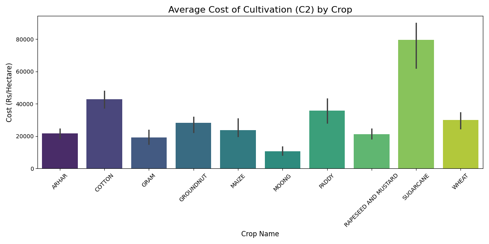
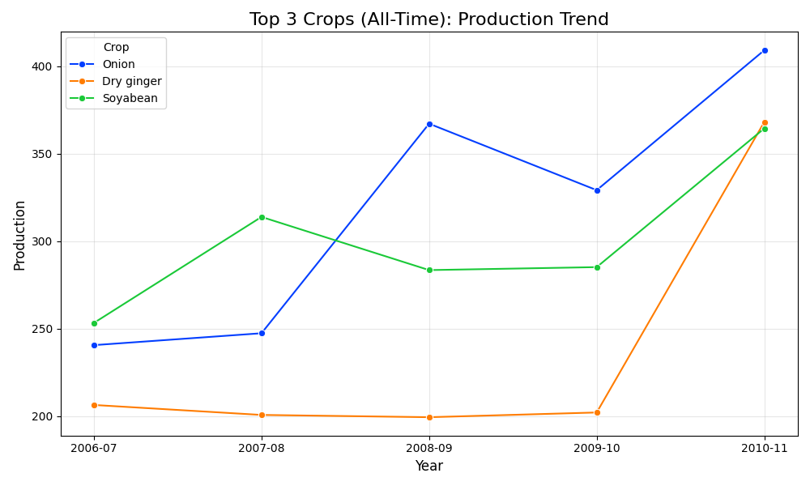
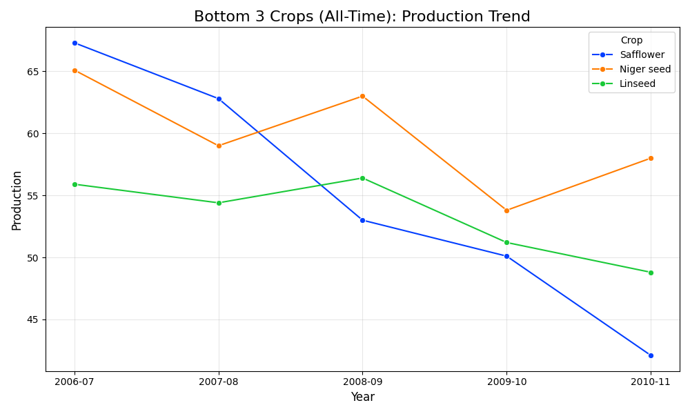
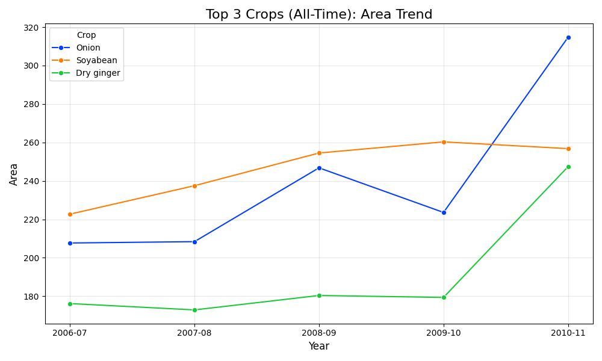
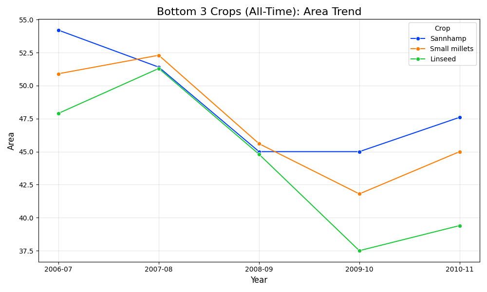
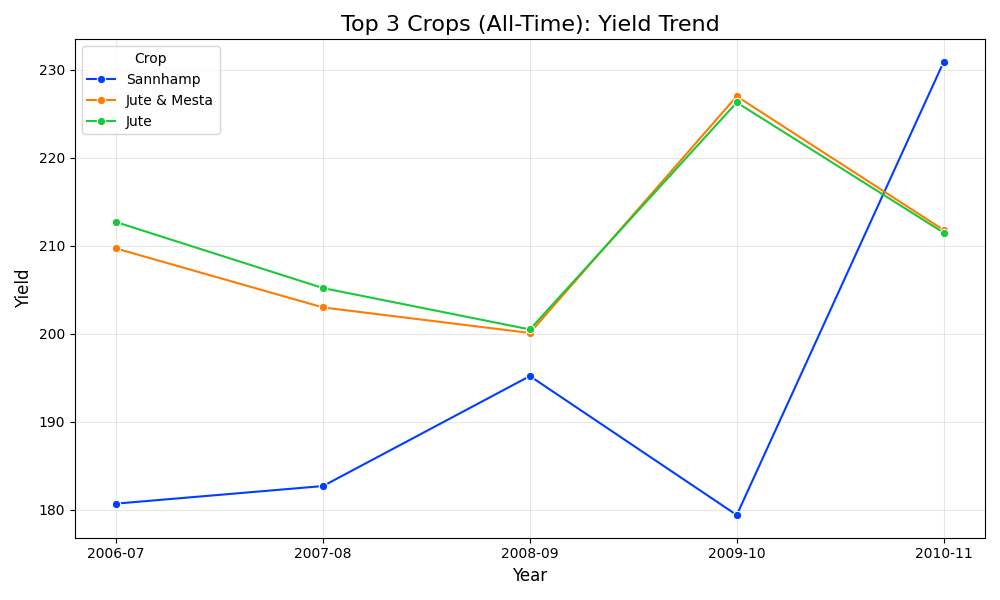
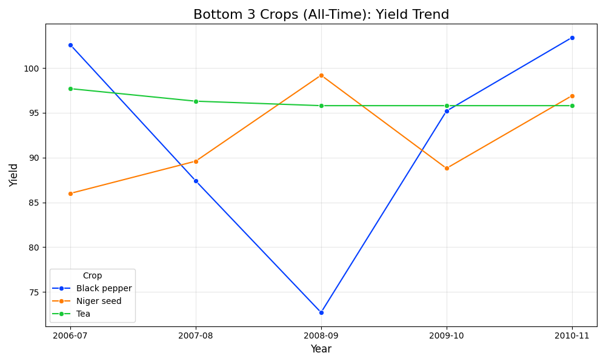
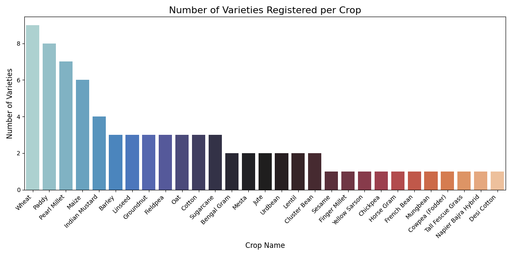
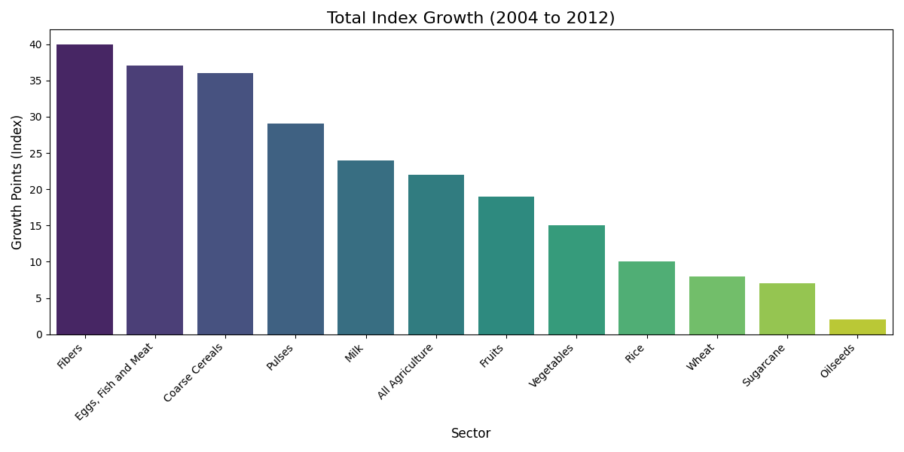

Project Report

**Analysis of Agriculture Crop Production in India** 
A Data-Driven Approach Using Python 

Course No.: MM62201 
Course Title: Introduction to Programming 

Submitted by: 

Aryan Bajia (25AG61R02) 
Suyash Gadage (25AG61R03) 

Indian Institute of Technology Kharagpur 

**Acknowledgement** 

We would like to express our sincere gratitude to Dr Subhamoy Mandal and Dr Raj Manna, our professor, for their exceptional guidance and encouragement throughout the Introduction to Programming course at IIT Kharagpur. Their profound knowledge of programming and ability to connect its principles to real-world applications, like this Agricultural Production Analysis  project,  have  been  pivotal  in  building  our  understanding  of  data  analysis  and visualisation.  

Our heartfelt appreciation also goes to our teaching assistants, Ms Manali Roy and Mr Rupam Mukherji, for their unwavering support, patience, and constructive feedback. Their hands-on assistance during lab sessions and their willingness to address our queries have been invaluable in enhancing our practical coding skills and analytical thinking.  

Through this project, we explored how programming and data science techniques, such as data preprocessing, visualisation, can solve real-world challenges like identifying which crops are suitable according to geography through the cost, production and yield data. These exercises deepened our knowledge of data handling, statistical analysis.  

This project would not have been possible without the collective support and guidance of our professor  and  teaching  assistants.  Their  dedication  and  encouragement  have  not  only strengthened our technical abilities but also instilled in us a passion for solving practical problems through programming and data analysis. 

1. Aryan Bajiya (25AG61R02) 
2. Suyash Gadage (25AG61R03) 

Date: 27/11/2025 
Place: IIT Kharagpur 

**Table of Contents** 

||Acknowledgement |i |
| :- | - | - |
||Table of Contents  |ii |
||List of Figures |iii |
||Chapter 1: Introduction |1 |
|1\.1 |Introduction |1 |
|1\.2 |Objective |2 |
|1\.3 |Dataset and its specifications |3 |
||Chapter 2: Data Preparation |4 |
|2\.1 |Data Handling |4 |
|2\.2 |Specific Data Formatting and Cleaning |5 |
||Chapter 3: Exploratory Data Analysis (EDA) |6 |
|3\.1 |Introduction |6 |
|3\.2 |Descriptive Statistics (Cost & Yield) |6 |
|3\.3 |Trend and Growth Analysis |7 |
||Chapter 4: Data Visualisation |8 |
|4\.1 |Introduction |9 |
|4\.2 |Cost and Yield Visualisation |9 |
|4\.3 |Trend Analysis (The Onion Boom) |10 |
|4\.4 |Sectoral Growth and Varieties |14 |
||Chapter 5: Conclusion |16 |
|5\.1 |Conclusion |16 |
|5\.2 |Key Findings |16 |
|5\.3 |Industrial Applications |16 |
|5\.4 |Limitations and Future Scope |17 |

**List of Figures** 

|**Fig. No.** |**Title** |**Page No.** |
| - | - | - |
|4\.1 |Average Cost of Cultivation |9 |
|4\.2 |Top High-Yielding Crops & their States |10 |
|4\.3 |Top & Bottom Production Trend |11 |
|4\.4 |Top & Bottom Area Trend |12 |
|4\.5 |Top & Bottom Yield Trend |13 |
|4\.6 |Variety per Crop |14 |
|4\.7 |Total Index Growth |14 |
|4\.8 |Total Index Growth (Trend) |15 |

**Chapter 1: Introduction** 

1. **Introduction** 

Agriculture forms the bedrock of the Indian economy and is a culturally important sector that sustains the livelihoods of roughly 58% of the nation's population. It is not only valued for the role it plays in ensuring national food security, but also for the supply of raw materials to various industries. Needless to say, the sector faces its own share of systemic problems. Amidst a wide variety of crops cultivated across the subcontinent, some regions exhibit high levels of efficiency and profitability, while others are fraught with volatility, low yields, and unstable pricing. The differentiation of efficient crop cycles with good returns versus resource-draining agricultural practices becomes relevant, as even minor inefficiencies in planning have serious consequences on farmer income and market stability. 

Policymakers,  agriculturists,  and  economists  most  often  rely  on  fragmented  reports  and isolated snapshots of data, such as seasonal yield or market price, to gauge the health of the sector. These isolated metrics are sometimes misleading, since high production volumes do not always translate into high profitability and efficiency in yield. This challenge has promoted the need  for  reliable,  data-driven  methods  to  classify  agricultural  performance  based  on comprehensive  variables  such  as  cost  of  cultivation,  volume  of  production,  and  genetic diversity. The availability of data analytics and Python-based visualisation, therefore, creates an opportunity to increase the accuracy and reliability of agricultural assessments. 

The concern of determining the optimal cropping patterns is not confined to individual farmers; rather, it pertains equally to state-level planning and national food policy. Basic crops, such as Saccharum officinarum (sugarcane) and Allium cepa (onion), are grown on a large scale and are crucial to the economy. On the other hand, specific cultivation in certain regions involves high economic risks and depletion of natural resources, such as the cultivation of water- intensive crops in arid regions. The concern is more critical in a developing economy, such as India, where agricultural distress is often heightened by the lack of adequate integrated data and  proper  analytical  tools  to  predict  "booms  and  busts,"  such  as  the  infamous  Onion production spike of 2010. 

These challenges can be overcome only by analysing the characteristics of the production of crops systematically. Data analysis and visualisation can reveal patterns and features that distinguish highly efficient cropping systems from those that are merely capital-intensive with low yield. These will help stakeholders at large with accurate and data-based information and assist experts in decision-making on subsidy allocation, crop selection, and regional focus. 

This  project  focuses  on  using  a  consolidated  repository  for  the  Government  of  India's agricultural records to perform an in-depth analysis using cost, production, variety, and time- series trend datasets. Techniques such as data cleaning, correlation analysis, and time-series visualisation are applied to extract meaningful insights. The output of this project is expected to form the basis of future predictive models and real-world policy applications. Furthermore, this study could have broader applications outside of mere academic research. It will help in proposing economic policies, enhance farming practices by indicating regions of high ROI, such as Sugarcane in Tamil Nadu versus Uttar Pradesh, and encourage tool development for market forecasting. In an increasingly data-driven world, using analytics to solve real-world problems,  such  as  inefficiency  in  agriculture,  represents  a  juncture  where  technology, economics, and national development meet. 

2. **Objectives** 

This  report  is  aimed  at  analysing  the  trends  of  agriculture  in  India  through  data-driven techniques, focusing on pinpointing those features that distinguish efficient and sustainable production  from  volatile  and  high-cost  cultivation.  By  implementing  data  analysis  and visualisation techniques in this study, an effort has been made to find patterns and insights within the dataset that would provide a better understanding of the agricultural landscape. 

Specific goals of this analysis include the following. 

- Agricultural Datasets Analysis: The aim is to understand the basic characteristics of cost, yield, and production volumes associated with different states. 
- To identify key differentiators: To demarcate high-efficiency crops-meaning low cost and high yield-from capital-intensive crops to optimise resource allocation. 
- Unify disparate metrics to generate insights-for instance, from fragmented data (Cost vs. Yield) into one that shows the spike in production when an area expands. 
- To  do  statistical  visualisations:  Use  Python  libraries-  Pandas,  Matplotlib-to  map historical trends such as the 2010 Onion Boom and long-term sector growth. 
- Building a base for future uses: to establish the foundation for predictive modelling that can forecast production anomalies and help to stabilise market prices. 
3. **Dataset and its specifications** 

The data in this study consist of a comprehensive collection of government agricultural records, sourced to provide a multidimensional view of the sector. It serves as an open-access resource for analysing the economic and biological factors of Indian agriculture. 

Dataset Specifications : 

- Composition: The project makes use of five different datasets: Cost of Cultivation, Production Volume, Crop Varieties, Agricultural Indices, and Time Series Data. 
- Temporal range: The data represent a very long historical period of time, from 1993 until 2014. 
- Features include critical attributes like Cost C2 (comprehensive cost per hectare), Yield (Quintal/Hectare), Production (Tonnes), and State-wise breakdowns. 
- Target Variables: Indicators of major interest are ROI per crop, yield leaders by state, and growth within the sector, for example, Fibres vs. Foodgrains. 
- Data Type: The data contains numerical values, like cost and yield, and categorical variables, like Crop Name, State, and Variety, which represent physical and economic characteristics. 

These data sets are used in this study to systematically explore and analyse agricultural patterns, with a view to creating a data-driven understanding of crop production dynamics in India. 

**Chapter 2: Data Preparation** 

Data preparation is a vital task in every data analysis or machine learning project. It makes sure the data is clean, consistent, and in a format ready to be analysed. Only correctly prepared data can allow us to draw meaningful insights, identify patterns, and build reliable models. For this agricultural crop analysis study, the researcher must undertake data preparation with respect to handling missing values, standardising inconsistent column naming across several files, and formatting time-series data for temporal analysis. Such steps will guarantee that the dataset is ready  for  exploratory  data  analysis  and  visualisation,  and  enhance  the  accuracy  and interpretability of results. 

The various ways in which each of the aspects of data preparation was implemented are explained in detail in the following sections, with references to the provided code logic. 

1. **Data Handling** 

There are five distinct files within the Agriculture Dataset, each with a different structure. Handling missing values before analysis is crucial to make sure that no piece of information is lost in calculating the averages or sums when required. Missing values in production or cost records  are  typically  filled  using  zero-filling  or  forward-filling  methods,  whichever  is appropriate for the data type. 

Code Implementation: 

First, the code reads the datasets into a dictionary of DataFrames. Following this, we provide a function for general cleaning: it removes extra spaces from column names, such as renaming "State " to "State"; and it also removes duplicate rows. For missing values, in particular in the time-series data (Dataset 5) and in the varieties data (Dataset 3), we fill gaps to avoid errors when aggregating. 

def clean\_dataset\_5(df):

- Standardize Column Names df.columns = df.columns.str.strip()
- Fill Missing Values
- Since this is a time series, empty usually means "no data recorded".
- We fill with 0 so we can calculate averages/sums without errors.

  df = df.fillna(0)

  return df

Outcome: 

After handling the missing values, the resulting datasets are robust and free from null pointers; this is assured during the inspection phase. This ensures that calculations for "All-Time Highs" or "Average Costs" do not fail due to sparse data. 

2. **Specific Data Formatting and Cleaning** 

The project uses five different datasets: Cost, Production, Varieties, etc., so simple cleaning will not  suffice. Each one of them needs special  formatting to  be "coding-friendly."  For example, Dataset 1 has special character column headers, while Dataset 2 contains summary rows-"Total"-which should be removed to avoid double-counting. 

Code Implementation: 

We implemented specific cleaning functions for each dataset: 

- Cost Dataset 1: Rename complicated columns like Cost of Cultivation (/Hectare) C2 to Cost\_C2 for easy access. 
- Dataset 2 (Production): Removes rows in which the 'Crop' column begins with 'Total'. 
- Dataset 4 - Indices: Converts year columns, like "3-1993", to a consistent format of Year\_1993 and forces numeric conversion to handle any non-numeric artefacts. 

def clean\_dataset\_1(df):

""" 

Renames complex column names to simple coding-friendly names. """ 

new\_names = {

'Cost of Cultivation ( /Hectare) A2+FL': 'Cost\_A2\_FL', 'Cost of Cultivation ( /Hectare) C2': 'Cost\_C2',

'Cost of Production ( /Quintal) C2': 'Production\_Cost', 'Yield (Quintal/ Hectare)': 'Yield'

} 

df = df.rename(columns=new\_names)

return df

Outcome: 

All features and target variables are now standardised across the five datasets. The column names are the same, such as Year\_2010, for example. Non-data rows (totals) were removed so that  subsequent  statistical  analyses  reflect  the  performance  of  actual  crops,  rather  than aggregated noise. 

**Chapter 3: Exploratory Data Analysis (EDA)** 

1. **Introduction** 

EDA  is  an  important  process  in  which  one  gets  to  understand  the  underlying  pattern, relationship,  and  structure  of  the  data  set.  The  process  involves  summarising  major characteristics  of  the  dataset  through  statistical  and  visual  techniques.  In  the  context  of agricultural production, EDA will seek to uncover key features that signal how high-efficiency crops differ from those that are capital-intensive. Descriptive statistics analyses, correlation analysis, and time-series observation might highlight critical insights into the data set and prepare one for higher-level analyses. 

For this analysis, we selected the following three main characteristics of EDA: 

- Descriptive  Statistics:  Overall  data  set  financial  characteristics  (Cost,  Yield)  to determine which of the crops are too expensive versus efficient. 
- Trend  Analysis:  This  examines  historical  highs  and  lows  to  identify  production "booms", such as the Onion spike. 
- Sectoral  Growth  Analysis:  This  involves  gauging  growth  rates  across  different agricultural sectors, such as Fibres vs. Oilseeds, to understand the shifts at the macro- economic level. 
2. **Descriptive Statistics (Cost & Yield)** 

Code Implementation: 

We analyse Dataset 1 to compute the summary statistics related to the Cost of Cultivation and Yield. The code identifies the crop with the maximum Cost\_C2 and the crop with the highest yield. 

def analyze\_dataset\_1(df):

- Summary Statistics

summary = df[['Cost\_A2\_FL', 'Cost\_C2', 'Yield']].describe()

- Most Expensive Crop (Cost C2)

max\_cost\_row = df.loc[df['Cost\_C2'].idxmax()]

- Highest Yielding State & Crop max\_yield\_row = df.loc[df['Yield'].idxmax()]

Outcome: 

The statistical analysis shows clear economic profiles for crops: 

- Most Expensive: The cultivation cost of sugarcane in Andhra Pradesh was the highest at ₹ 91,442/ha, which presents a high barrier to entry. 
- Highest Yield: The highest yield of sugarcane in Tamil Nadu was reported as 1015.45 Quintal/ha. 
- Efficiency:  Despite  high  costs,  Sugarcane  in  Tamil  Nadu  has  the  lowest  cost  of production per quintal (₹85.79), thus illustrating the "Southern Efficiency Paradox"- superior yields offset high input costs. 
3. **Trend and Growth Analysis** 

Code Implementation: 

We compute the percentage growth of land area and the absolute growth of sectoral indices using Dataset 2 (Production) and Dataset 4 (Indices) to understand the drivers behind the production spikes and sectoral shifts. 

def analyze\_dataset\_2(df):

- Calculate Percentage Growth in Area (2006-07 to 2010-11) df['Area\_Growth']  =  ((df['Area\_2010\_11']  -  df['Area\_2006\_07'])  / 

df['Area\_2006\_07']) \* 100

fastest\_growth  =  df.sort\_values(by='Area\_Growth', ascending=False).iloc[0]

print(f"Fastest Expanding Crop: {fastest\_growth['Crop']}")

def analyze\_dataset\_4(df):

- Calculate Total Growth (Last Year - First Year)

df['Total\_Growth'] = df[last\_year] - df[first\_year]

fastest\_sector  =  df.sort\_values(by='Total\_Growth', ascending=False).iloc[0]

Outcome:  

- Production Boom: The analysis identifies Onion as having the highest single-year production volume in 2010-11 (409.1 Units).  
- Land  area  expansion:  Banana  ranked  as  the  fastest  expanding  crop  land  area,  at +73.98% growth.  
- Sectoral Shift: Fibres sector growth was the fastest at +40.0 Index Points, and Oilseeds was the slowest at +2.0 points, quantitatively confirming the shift from food grains to commercial crops. 

**Chapter 4: Data Visualisation** 

1. **Introduction** 

Data visualisation is a crucial component of exploratory data analysis, enabling us to find patterns and relationships in the dataset that are difficult to observe from raw numbers alone. In agricultural analysis, these techniques of visualisation show how costs vary across crops, how yields differ by geography, and how sectors evolve. Such insights help identify key regions for specific crops and inform policy decisions. 

For this project, we used these primary visualisation techniques: 

- Feature Distribution Visualisations: Bar plots showing differences in Cost and Yield for each crop. 
- Time Series Plots: Line graphs showing the "Onion Boom" and historical anomalies. 
- Growth Charts by Sectors: Mapping the macro transitions in the economy through growth indices. 
- Variety Counts: Bar charts identifying research biases in genetic diversity. 
2. **Cost and Yield Visualisations** 

Feature distribution  visualisations  help  in  analysing  how financial metrics are distributed across different crops. 

Fig 4.1. Average Cost of Cultivation 

Fig 4.2. Top High-Yielding Crops & their States Code Implementation: 

We visualise the average Cost\_C2 for each crop using Seaborn's barplot. 

def plot\_dataset\_1(df):

plt.figure(figsize=(12, 6))

sns.barplot(data=df, x='Crop', y='Cost\_C2', palette='viridis') plt.title('Average Cost of Cultivation (C2) by Crop')

Outcome:  

These bar charts demonstrate a large inequality  in  capital  requirements.  Sugarcane is  an outright aberration, requiring from 3x to 4x more capital than Wheat or Gram. Further, state- wise  yield  plots  place Tamil  Nadu  and  Karnataka  well  above  Uttar  Pradesh  in  terms  of efficiency and visually reinforce the statistical findings presented in Chapter 3. 

3. **Trend Analysis (The Onion Boom)** 

A time-based visualisation of data is key to finding trends, spikes, or anomalies. We focused on those specific "Boom" years captured in the analysis. 

Code Implementation: 

We create line plots for the Top 3 crops based on all-time high production to observe trends. 

def plot\_dataset\_2(df):

- Plots Trends (All Years) for Production, Area, and Yield.
- Selects Top 3 based on their ALL-TIME Highest value. sns.lineplot(data=melted, x='Year', y='Production', hue='Crop') plt.title('Top 3 Crops (All-Time): Production Trend')

Fig 4.3. Top & Bottom Production Trend 

Fig 4.4. Top & Bottom Area Trend 

Fig 4.5. Top & Bottom Yield Trend 

Outcome: 

The time series plot captures the "Onion Boom" of 2010. The spike upward in the blue production line tracks perfectly with the area expansion line. This visual suggests that farmers fueled the boom with aggressive expansion of land area, and not due to technological yield improvement. 

4. **Sectoral Growth and Varieties** 

We visualise sectoral indices and genetic variety counts to understand the macro-economic shifts and research focus. 

Fig 4.6. Variety per Crop 

Fig 4.7. Total Index Growth 

Fig 4.8. Total Index Growth (Trend) Code Implementation: 

For indices, we use line charts; for variety counts, we use bar charts. 

def plot\_dataset\_3(df):

- Bar Chart showing the Number of Varieties per Crop. sns.barplot(data=plot\_data,  x='Crop',  y='Variety\_Count', 

palette='icefire')

def plot\_dataset\_4(df):

- Trend Line Chart (All Sectors)

sns.lineplot(data=df\_melted, x='Year', y='Index\_Value', hue='Crop')

Outcome:  

Genetic Gap: The varieties' bar chart shows an alarming unevenness. Wheat and Paddy are represented by long bars (9 and 8 varieties), while Sesame and Lentil have bars barely reaching out of the x-axis (1 or 2). This visualises the "Genetic Monoculture" risk.  

Macro Shift: Sectoral trend lines indicate Fibres and Eggs/Meat rising with a steep slope, while traditional Oilseeds have flatter lines, thus reflecting a structural shift within the agricultural economy. 

**Chapter 5: Conclusion** 

1. **Conclusion** 

This section summarises the findings of the agricultural crop production study by focusing on what was learned, how it could be applied in practical terms, and limitations to outline what is not covered by the analysis. The purpose of this section is to consolidate findings and provide actionable information, ensuring the value of the study goes beyond theoretical exploration. 

Agricultural analysis, in particular, becomes very important in differentiating between high- efficiency and low-yield areas, considering real-life applications. We identify from the findings some key observations: cost barriers, geographical advantages, and genetic research gaps. 

2. **Key Findings** 

Key findings represent the most striking results that come out of the analysis, underlining the features and patterns that set apart various kinds of successful cropping strategies. These are obtained using statistical tests, visualisations, and time-series analyses. 

- Southern Efficiency Paradox: While Andhra Pradesh has the highest input costs, Tamil Nadu can achieve the lowest production cost per unit due to superior yields (> 1000 Qt/Ha) and, therefore, is the most efficient region for Sugarcane. 
- Area-driven booms: The 2010 "Onion Boom" was driven almost solely by a 200% increase in land area, not yield improvement. 
- Macro Shifts: The economy is structurally shifting towards Fibres that are up +40 growth points and Protein, up Eggs/Meat +37 points, while traditional oilseeds stagnate. 
- Genetic Monoculture: A strong bias exists in research; staple crops like Wheat have 9 registered varieties,  cash crops like Sesame only  1, leaving  farmers vulnerable to greater biological risk. 
3. **Industrial Applications** 

Practical applications are the translation of insight from analysis into actionable strategies for real-world use. These have immense applicability and are very essential for economic planning in Indian agriculture. 

- Regional Planning: Policy should encourage cultivation of Sugarcane in South India, where ROI is highest, rather than expansion in less efficient Northern regions. 
- Genetic Research: Agricultural universities should focus on developing new varieties for neglected cash crops, lentils, and sesame to help improve their resilience against pests and climate change. 
- Market  Forecasting:  Knowing  that  "booms"  are  often  area-driven  allows  the government to predict surplus/deficit based on early-season sowing data before the harvest arrives. 
4. **Limitations and Future Scope** 

Limitations reflect the constraints, whereas the future scope delineates potential improvements. The rationale behind this is to ensure transparency and provide guidelines for further research. 

Limitations: 

- Data Fragmentation: The data set was fragmented across different files and formats, with large bespoke cleaning needed. 
- 2014 Anomaly: A huge drop in data in 2014 of -388k units worldwide suggests either an anomaly in the collection process or a disastrous event, making it difficult to rely on recent trends. 
- Data on rainfall or soil health, which are considered very critical drivers of yield, are missing from the analysis. 

Future Scope: 

- Predictive Modelling: Employing machine learning (example: Random Forest) on land- area trends to forecast future production spikes. 
- Climate Integration: Match the 2014 data crash with rainfall data to check for impacts of drought. Dashboard Deployment: Convert this static Python analysis to an interactive web app using Streamlit for real-time policy monitoring. 
16 

